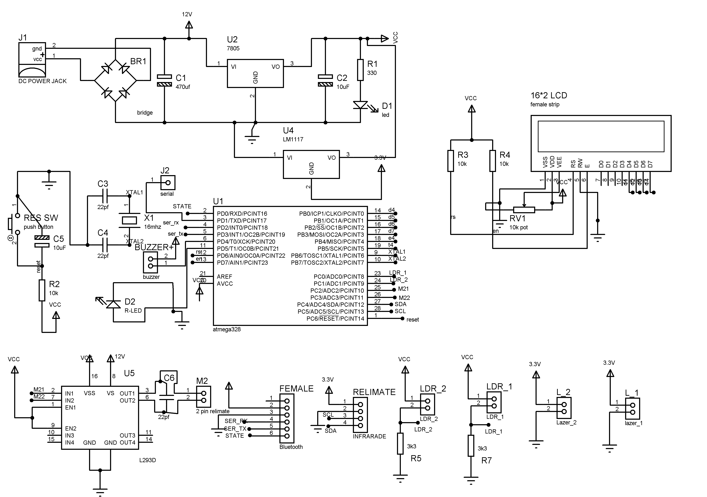
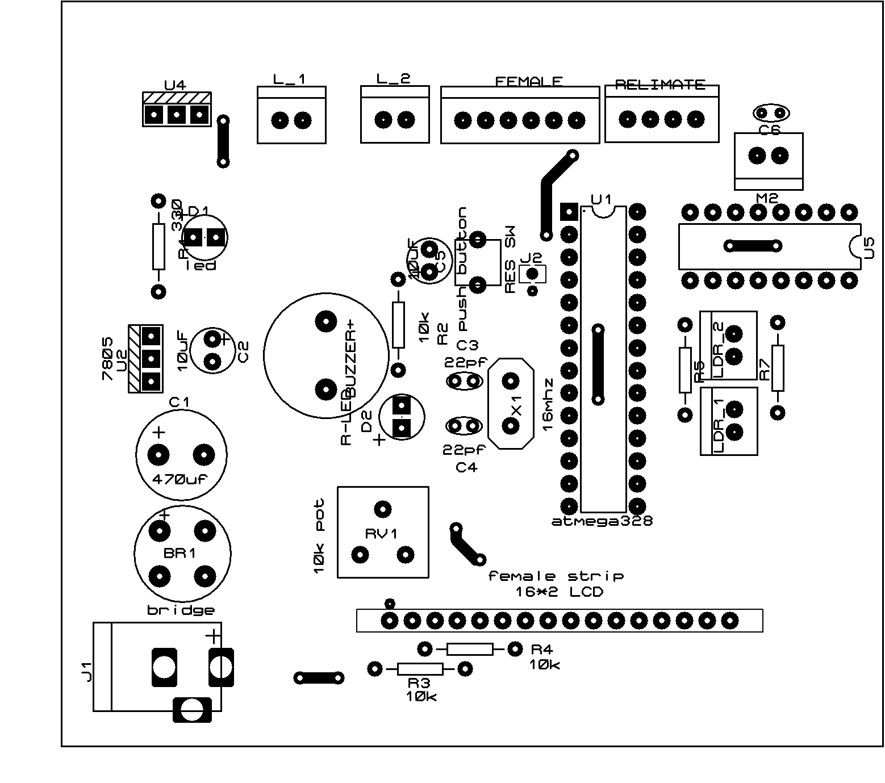

<div align="center">

# 🌡️ Auto Temperature Detector for Entrance
### COVID-19 Safety & Access Control System

A non-contact, automated entry-screening system built on the **ATmega328**, combining infrared temperature sensing, laser-based presence detection, and Bluetooth-configurable access control — with real-time status on an onboard LCD.

[](./LICENSE)
[](./Code)
[](./Code)
[]()

[Demo](#-demo) • [Features](#-features) • [Hardware](#-hardware) • [Getting Started](#-getting-started) • [Repo Structure](#-repository-structure) • [License](#-license)

</div>

---

## 📖 Overview

COVID-19 made temperature screening and occupancy control mandatory at building entrances. This project automates that process end-to-end: a laser diode/receiver pair detects when someone approaches, a non-contact IR sensor takes their temperature instantly, and the system grants or denies entry based on a configurable safe threshold — no manual checks required.

Room occupancy is tracked live and can be capped at a preset limit. Everything — temperature threshold, occupancy cap, and current headcount — can be monitored and configured wirelessly over Bluetooth.

## 🎥 Demo

> Full demonstration video and build photos are available in [`/Videos`](./Videos) and [`/Images`](./Images).

<div align="center">


</div>

## ✨ Features

- 🔴 **Contactless temperature screening** using an infrared sensor — no physical contact needed
- 🚦 **Automatic entry control** — grants/denies access based on a configurable temperature threshold
- 👥 **Live occupancy tracking** with a preset maximum room capacity
- 📱 **Bluetooth configuration** — set thresholds and view live occupancy from a mobile app
- 🖥️ **Real-time LCD status display**
- 🔋 **Regulated, protected power supply** (bridge rectifier + 7805 regulator with thermal/short-circuit protection)

## 🧩 Hardware

| Component | Role |
|---|---|
| **ATmega328** | Core microcontroller |
| Non-Contact IR Temperature Sensor | Body temperature measurement |
| Laser Diode + Receiver | Entrance / presence detection |
| HC-05 Bluetooth Module | Wireless config & monitoring |
| 16x2 LCD Display | Real-time status output |
| 7805 Voltage Regulator | Regulated 5V supply |
| Diode Bridge Rectifier | AC → DC conversion |
| BC547 Transistor | Switching |
| Buzzer | Audible alerts |
| LED | Power / status indication |
| Resistors, Capacitors, Crystal Oscillator | Supporting circuitry |
| Push Buttons | Manual overrides |

📋 Full parts list with quantities: [`Hardwares/BOM.xlsx`](./Hardwares/BOM.xlsx)
📑 Component datasheets: [`/Datasheets`](./Datasheets)

## ⚙️ How It Works

```
 ┌────────────┐     ┌──────────────────┐     ┌─────────────────┐
 │  Laser +   │────▶│  IR Temperature   │────▶│  Threshold Check │
 │  Receiver  │     │     Sensor        │     │   (ATmega328)    │
 └────────────┘     └──────────────────┘     └────────┬─────────┘
                                                         │
                              ┌──────────────────────────┼──────────────────────────┐
                              ▼                                                     ▼
                     ✅ Below Threshold                                    ❌ Above Threshold
                     → Entry Granted                                      → Entry Denied
                     → Occupancy +1                                       → Buzzer Alert
                              │                                                     │
                              └──────────────────────┬──────────────────────────────┘
                                                       ▼
                                          📟 LCD Status + 📱 Bluetooth Sync
```

## 🚀 Getting Started

### Prerequisites
- [Arduino IDE](https://www.arduino.cc/en/software)
- ATmega328-based board (Arduino Uno/Nano or standalone chip + ISP programmer)
- HC-05 Bluetooth module paired with a serial terminal or companion app

### Installation

```bash
# 1. Clone the repository
git clone https://github.com/Fahedshaikh32/Auto-Temperature-Detector-Covid-Safety.git

# 2. Open the sketch
Code/code.ino.txt   # rename to code.ino before opening in Arduino IDE
```

1. Wire the circuit as shown in [`/Images`](./Images).
2. In Arduino IDE: **Tools → Board** → select your ATmega328-based board.
3. **Tools → Port** → select the correct COM/serial port.
4. Click **Upload**.
5. Power the circuit via the regulated 5V supply.
6. Pair your phone with the HC-05 module and configure temperature threshold + room capacity.

## 📁 Repository Structure

```
├── Code/            Arduino / ATmega328 firmware
├── Datasheets/      Component datasheets
├── Docs/            Reference material & report format template
├── Hardwares/        Bill of Materials (BOM)
├── Images/          Circuit diagram, PCB layout, block diagram, photos
├── Videos/          Project demo video
├── LICENSE          MIT License
└── README.md
```

## 📚 Documentation

- [`Docs/Documentation Data.docx`](./Docs) — theory & component background
- [`Docs/Report_format_guide.pdf`](./Docs) — department report formatting template

## 🤝 Contributing

Contributions, issues, and feature requests are welcome. Feel free to check the [issues page](../../issues) or open a pull request.

## 📄 License

This project is licensed under the [MIT License](./LICENSE).

---

<div align="center">
Made with ❤️ for safer public spaces
</div>
