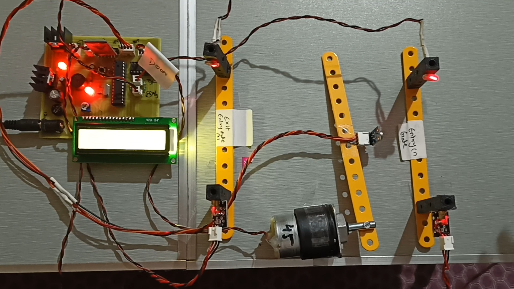

<div align="center">



# 🌡️ Auto Temperature Detector for Entrance
### A Non-Contact COVID-19 Safety & Access Control System

Automated entrance screening built on the **ATmega328** — contactless temperature checks, live occupancy control, and Bluetooth-based configuration, all in one embedded system.

<p>


</p>

<p>
<a href="#-demo">Demo</a> •
<a href="#-features">Features</a> •
<a href="#-system-architecture">Architecture</a> •
<a href="#-hardware">Hardware</a> •
<a href="#-getting-started">Getting Started</a> •
<a href="#-repository-structure">Structure</a> •
<a href="#-roadmap">Roadmap</a> •
<a href="#-license">License</a>
</p>

</div>

---

## 📖 Overview

The COVID-19 pandemic made temperature screening and occupancy limits mandatory at building entrances — a manual, staff-heavy process prone to human error and bottlenecks. This project automates the entire workflow in hardware:

A laser diode/receiver pair detects when a person approaches the entrance. A non-contact infrared sensor instantly measures their body temperature. If the reading falls within a safe, configurable range, entry is granted and the live occupancy counter increments; if not, entry is denied and an alert is raised. Room capacity, temperature threshold, and current occupancy are all visible and configurable in real time over Bluetooth — no manual dashboard, no physical checkpoint staff required.

## 🎥 Demo

<div align="center">


</div>

> 📹 Full demonstration video available in [`/Videos`](./Videos)

## ✨ Features

| | |
|---|---|
| 🔴 **Contactless Screening** | Infrared sensor takes temperature without any physical contact |
| 🚦 **Automatic Access Control** | Grants or denies entry based on a configurable temperature threshold |
| 👥 **Live Occupancy Tracking** | Enforces a preset maximum room capacity in real time |
| 📱 **Bluetooth Configuration** | Set thresholds, view occupancy, and monitor status from a mobile app |
| 🖥️ **Real-Time LCD Feedback** | 16×2 display shows live system status at the entrance |
| 🔔 **Audible Alerts** | Buzzer signals denied entry or fault conditions |
| 🔋 **Protected Power Supply** | Bridge rectifier + 7805 regulator with thermal & short-circuit protection |

## 🧠 System Architecture

```
   ┌─────────────┐      ┌───────────────────┐      ┌────────────────────┐
   │  Laser +    │─────▶│   IR Temperature   │─────▶│   ATmega328 Core    │
   │  Receiver   │      │      Sensor        │      │  (Decision Logic)  │
   └─────────────┘      └───────────────────┘      └──────────┬─────────┘
      Presence               Body Temp                        │
      Detection               Reading                         │
                                                ┌───────────────┴───────────────┐
                                                ▼                               ▼
                                     ✅  Within Threshold              ❌  Above Threshold
                                     • Entry Granted                   • Entry Denied
                                     • Occupancy +1                    • Buzzer Alert
                                     • LCD: "Access OK"                • LCD: "Access Denied"
                                                │                               │
                                                └───────────────┬───────────────┘
                                                                 ▼
                                                    📟 LCD Status  +  📱 Bluetooth Sync
                                                (threshold, occupancy, live headcount)
```

## 🧩 Hardware

<div align="center">

| Component | Role |
|---|---|
| **ATmega328** | Core microcontroller — decision logic & control |
| Non-Contact IR Temperature Sensor | Body temperature measurement |
| Laser Diode + Receiver | Entrance / presence detection |
| HC-05 Bluetooth Module | Wireless configuration & live monitoring |
| 16×2 LCD Display | Real-time status output |
| 7805 Voltage Regulator | Regulated, protected 5V supply |
| Diode Bridge Rectifier | AC → DC conversion |
| BC547 Transistor | Switching |
| Buzzer | Audible alerts |
| LED | Power / status indication |
| Resistors, Capacitors, Crystal Oscillator | Supporting circuitry |
| Push Buttons | Manual overrides |

</div>

📋 Full parts list with quantities — [`Hardwares/BOM.xlsx`](./Hardwares/BOM.xlsx)
📑 Component datasheets — [`/Datasheets`](./Datasheets)

## 🚀 Getting Started

### Prerequisites

- [Arduino IDE](https://www.arduino.cc/en/software)
- ATmega328-based board (Arduino Uno/Nano, or a bare ATmega328 + ISP programmer)
- HC-05 Bluetooth module + a serial terminal or companion mobile app

### Installation

```bash
# Clone the repository
git clone https://github.com/Fahedshaikh32/Auto-Temperature-Detector-Covid-Safety.git
cd Auto-Temperature-Detector-Covid-Safety

# Open the firmware
# Rename Code/code.ino.txt → code.ino before opening in Arduino IDE
```

1. Assemble the circuit as shown in the schematic and PCB layout in [`/Images`](./Images).
2. In Arduino IDE: **Tools → Board** → select your ATmega328-based board.
3. **Tools → Port** → select the correct serial/COM port.
4. Click **Upload** to flash the firmware.
5. Power the circuit through the regulated 5V supply as per the schematic.
6. Pair your phone with the HC-05 module and set your temperature threshold and room capacity via the companion app.

## 📁 Repository Structure

```
Auto-Temperature-Detector-Covid-Safety/
├── Code/            → Arduino / ATmega328 firmware
├── Datasheets/      → Component datasheets (ATmega328, sensors, regulator, etc.)
├── Docs/            → Reference material & department report format template
├── Hardwares/       → Bill of Materials (BOM)
├── Images/          → Circuit diagram, PCB layout, block diagram, demo photos
├── Videos/          → Project demonstration video
├── LICENSE          → MIT License
└── README.md
```

## 📚 Documentation

| File | Description |
|---|---|
| [`Docs/Documentation Data.docx`](./Docs) | Background theory & component reference material |
| [`Docs/Report_format_guide.pdf`](./Docs) | Department-prescribed report formatting template |

## 🗺️ Roadmap

- [ ] Add contactless door/gate actuation (motorized entry lock)
- [ ] Web dashboard for remote occupancy monitoring
- [ ] Data logging (temperature readings + timestamps) to SD card / cloud
- [ ] Multi-entry-point support with centralized occupancy sync

## 🤝 Contributing

Contributions, issues, and feature requests are welcome — feel free to check the [issues page](https://github.com/Fahedshaikh32/Auto-Temperature-Detector-Covid-Safety/issues) or open a pull request.

## 📄 License

This project is licensed under the [MIT License](./LICENSE).

---

<div align="center">

**Made with ❤️ for safer public spaces**

⭐ If this project helped you, consider giving it a star!

</div>
